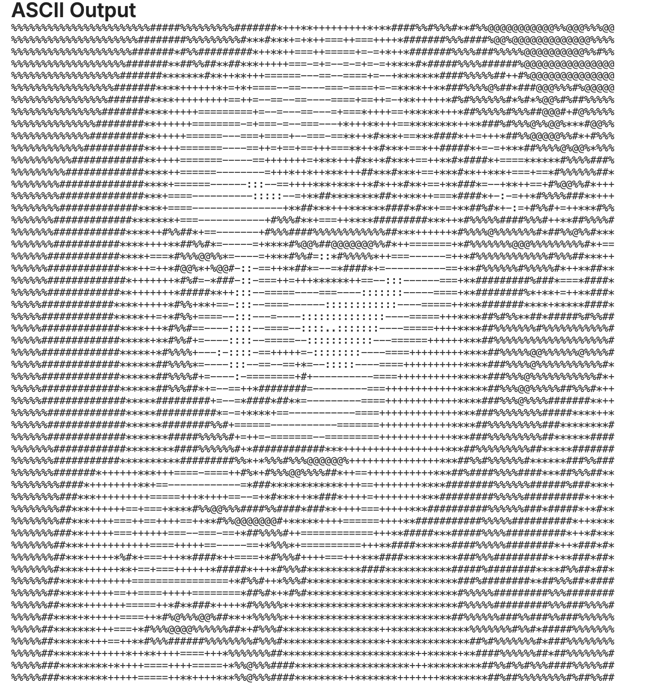

# ASCII Art Converter

This is a simple web-based tool that converts uploaded images into ASCII art.

## Live Demo

Frontend (hosted on GitHub Pages):  
[https://yourusername.github.io/ascii-art-frontend](https://yourusername.github.io/ascii-art-frontend)

## Features

- Upload an image and get ASCII art based on pixel brightness.
- Specify the desired width of the output.
- Backend is hosted on [PythonAnywhere](https://www.pythonanywhere.com).
- Uses a GitHub webhook to automatically update backend code on `git push`.

## API Routes

- `GET /`: Root route that returns "Hello world" (for testing).
- `POST /ascii/upload`: Accepts an image file and optional `width` parameter. Returns ASCII art as JSON.
- `POST /webhook`: GitHub webhook endpoint to auto-update backend and reload the server.

## Tech Stack

- Flask (Python)
- Pillow (for image processing)
- PythonAnywhere (hosting)
- Git + Webhook (for automatic deployment)
